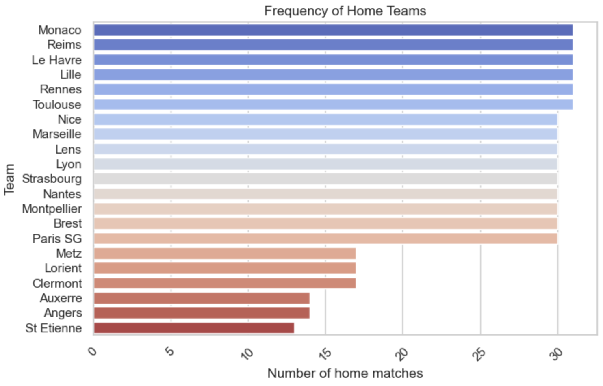

## Project - Football Prediction

This project focuses on designing, training, and evaluating a machine learning model for predicting football match outcomes. The initial implementation is based on the **French Ligue 1**, using data from the **2023-24 and 2024-25 seasons**.

The workflow includes:
- **Data preprocessing**: Cleaning match data, handling missing values, feature selection.
- **Model design and training**: Testing different ML algorithms such as logistic regression, random forests, and neural networks.
- **Performance evaluation**: Assessing model accuracy using various metrics.
- **Future extensions**: Expanding predictions to other leagues and sports.

## Introduction

Sports betting and data analytics have grown significantly in recent years. Machine learning techniques provide powerful tools to analyze historical match data and generate predictive insights.


The goal of this project is to explore different machine learning models to enhance football match outcome predictions.

---

## Dataset

The dataset consists of:
- Match statistics (e.g., goals, shots on target, possession)
- Home/away factors
- Player statistics (if applicable)

All the entries of the original dataset are described bellow : 

| Category               | Abbreviation | Description |
|------------------------|--------------|-------------|
| Match Information     | Date         | Match date. |
|                        | HomeTeam     | Team playing at home. |
|                        | AwayTeam     | Team playing away. |
| Full-Time Statistics  | FTHG         | Full Time Home Goals – Number of goals scored by the home team at the end of the match. |
|                        | FTAG         | Full Time Away Goals – Number of goals scored by the away team at the end of the match. |
|                        | FTR          | Full Time Result – Match result (H = home win, A = away win, D = draw). |
| Half-Time Statistics  | HTHG         | Half Time Home Goals – Number of goals scored by the home team at half-time. |
|                        | HTAG         | Half Time Away Goals – Number of goals scored by the away team at half-time. |
|                        | HTR          | Half Time Result – Half-time result (H, A, or D). |
| Referee               | Referee      | Match referee (missing in your examples). |
| Shooting Statistics   | HS           | Home Shots – Number of shots taken by the home team. |
|                        | AS           | Away Shots – Number of shots taken by the away team. |
|                        | HST          | Home Shots on Target – Number of shots on target by the home team. |
|                        | AST          | Away Shots on Target – Number of shots on target by the away team. |
| Discipline & Corners  | HF           | Home Fouls – Number of fouls committed by the home team. |
|                        | AF           | Away Fouls – Number of fouls committed by the away team. |
|                        | HC           | Home Corners – Number of corners earned by the home team. |
|                        | AC           | Away Corners – Number of corners earned by the away team. |
|                        | HY           | Home Yellow Cards – Number of yellow cards received by the home team. |
|                        | AY           | Away Yellow Cards – Number of yellow cards received by the away team. |
|                        | HR           | Home Red Cards – Number of red cards received by the home team. |
|                        | AR           | Away Red Cards – Number of red cards received by the away team. |

Using the lines following the comment `#anomalies in the data`, we can analyse it in order to detect any redundancy, etc. We notice that the dataset does not contain missing values, duplicate values, which will avoid data redundancy biases. Finally, the various breakdowns are well categorized. However, we will see in later sections that a data cleaning is still necessary. Now, let’s explore our dataset a little bit to get familiar with it. 

## Pipeline

### **Data Collection & Cleaning**  
   - Import and preprocess football match data.
   - Handle missing values and create relevant features.

First of all, we delete the columns "Date", "HTHG", "HTAG", "HTR" and  "Referee" that were not as relevant as the others to our study, using the code lines : 

```python 
columns_to_drop = ["Date", "HTHG", "HTAG", "HTR", "Referee"]
```
In order to grasp a better understanding of our dataset, let's plot some charts to see if we notice any unbalance. 

First of all, let's see the distribution of win-lose : 

<div align="center">
    
    <p><em>Football match data analysis for prediction.</em></p>
</div>

Home wins are the most common result, followed by away wins and then draws. This suggests a home advantage in the dataset, which should be considered when training our predictive model.

<div style="display: flex; justify-content: space-between;">
  
  
</div>

This bar chart illustrates how frequently each team played as an away team. Some teams, like Paris SG and Lens, appear more frequently, while others have significantly fewer away matches. Similar to the away teams distribution, this second chart shows the frequency of home games per team. The imbalance here suggests that some teams have had disproportionately more home matches. This could introduce bias when training a model to predict home performance.

<div align="center">
    
    <p><em>Football match data analysis for prediction.</em></p>
</div>

The graph shows the number of goals scored per match, split between home and away teams. The distribution suggests that home teams tend to score slightly more goals than away teams. However, the imbalance does not appear extreme, meaning goal prediction models might not suffer from significant bias.

<div style="display: flex; justify-content: space-between;">
  
  
</div>

Home teams receive about 44.4% of yellow cards, while away teams receive slightly more at 50.1%. Red cards are much rarer, with both home and away teams receiving them in small proportions. The slight imbalance might indicate that referees give more cards to away teams, which could be a small factor in predictive modeling.

Moreover, the fouls are nearly evenly split between home and away teams (49.2% vs. 50.8%), indicating no strong referee bias in foul calls. This balance suggests that fouls alone may not introduce significant bias into machine learning models.


### **Model Selection & Training**  
   - Implement various machine learning models (`scikit-learn`, `TensorFlow` for deep learning).
   - Tune hyperparameters for optimal performance.

### **Evaluation & Testing**  
   - Compare models using metrics like accuracy, F1-score, and confusion matrices.
   - Validate predictions using historical match data.

## Results & Future Work

- The current implementation focuses on Ligue 1 predictions.
- Future improvements:
  - Incorporating real-time player statistics.
  - Extending predictions to other leagues and tournaments.
  - Adding deep learning models for improved accuracy.

## Running the Project


## References

1. [Machine Learning Algorithms for Football Prediction Using Statistics from Brazilian Championship](https://medium.com/towards-data-science/machine-learning-algorithms-for-football-prediction-using-statistics-from-brazilian-championship-51b7d4ea0bc8/)
2. [Predicting Football Results with Statistical Modelling](https://dashee87.github.io/football/python/predicting-football-results-with-statistical-modelling/)


<!-- 

comments : 

<div align="center">
    
    <p><em>Football match data analysis for prediction.</em></p>
</div> -->
